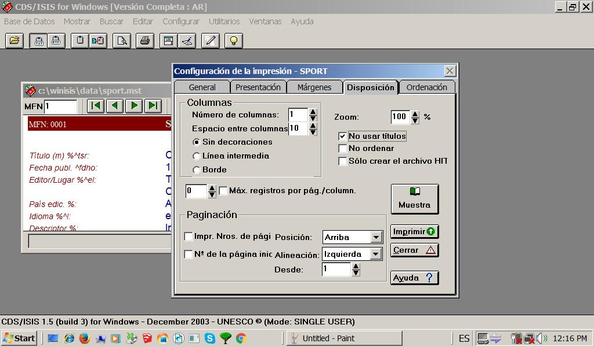

> *Caveat: This document describes procedures and steps to be done and is for _internal use_ and meets _our_ criteria*

## Exporting 
* Check the "health" of your operating system. Verify that your computer is out of viruses
* Disable sharing folders and files during the process of exporting
* If you had installed a PDF virtual printer, then follow the next step. If not, go to this [link](https://pdf.wondershare.com/top-pdf-software/free-pdf-printer.html) and install one of the options offered according your operating system
* Run WinIsis
* Check the health of the databases inside WinIsis. Validate and debug your records. Found and amend any incompatible character that can generate corrupted data. 
* In case of deleted records, WinIsis will warn about if we should save it or not. Choose accordingly
* Choose and open your database. Verify the _total sum_ of records (to export) or recognise what records you desire to export.
  

* (_Optional_) Update the dictionary (`Base de Datos` > `Actualizar Diccionario`)
* A dialog box will appear `Mantenimiento del Archivo Invertido`. Choose any of the options provided: `Actualizar`, `Inversión total`, `Reiniciación del Archivo Invertido`, `Crear archivos de enlaces`, `Clasificar los archivos`, `Cargar el Archivo Invertido`. Then, choose `Aceptar`
  

* Go to `Base de Datos` > `Imprimir`. Choose if you wish print `La búsqueda actual` or `Rango de MFN`: enter here the numbers of records you want to export; ej.: 1-999999. On `Salida a` choose your PDF virtual printer. In our case, we choose `Jaws PDF Creator`. Then, in `Formato de impresión`, choose the option `Formato predefinido`.
  

* Then go to tab `Márgenes`: enter `0` (zero) on `Superior`, `Inferior`, `Interior` and `Exterior` options. On `Tamaño del papel`: choose `A4` or `Legal`.  All the options in section `Especial`, state on `0` (zero). 
  

* Go to `Disposición` tab: on `Número de columnas` enter 1, on `Espacio entre columnas` enter `10`, then choose `Sin decoraciones`, state on `0` in `Máx. registros por pág./column.`; on section `Paginación` leave the default options: `Arriba`, `Izquierda`, `1`; on `Zoom` section enter `100` and point affirmatively in `No usar títulos`.
  

* Click on `Imprimir`. It will ask us to give a name to the pdf file that will be generated. Click on `Aceptar`.
* That pdf file generated can be edited in [LibreOffice](https://ask.libreoffice.org/es/question/57975/se-pueden-abrir-archivos-pdf-con-libreoffice/) and/or [Microsoft Word](https://support.office.com/es-es/article/editar-un-archivo-pdf-b2d1d729-6b79-499a-bcdb-233379c2f63a).
* You can check these links on how to find and replace text formats and special formats (such as character and paragraph formats), styles and highlighting, and change the format without changing the text in Word [here](https://support.office.com/es-es/article/buscar-y-reemplazar-texto-c6728c16-469e-43cd-afe4-7708c6c779b7) (Windows), or [here](https://support.office.com/es-es/article/buscar-y-reemplazar-texto-o-formato-en-word-para-mac-ac12f262-e3cd-439a-88a0-f5a59875dcea) (macOSX).

### Changelog ###

* 2019-04-31: Added badges and legalese sections. Minor semantic issue fixed. Added steps for the `Disposición` tab.

### To-do ###
* ~~Screen captures for the steps to do~~

### Copyright ###

This work is licensed under a [Creative Commons Attribution-ShareAlike 2.0 Generic License](http://creativecommons.org/licenses/by-sa/2.0/).

### Legal ###

* All trademarks are the property of their respective owners.