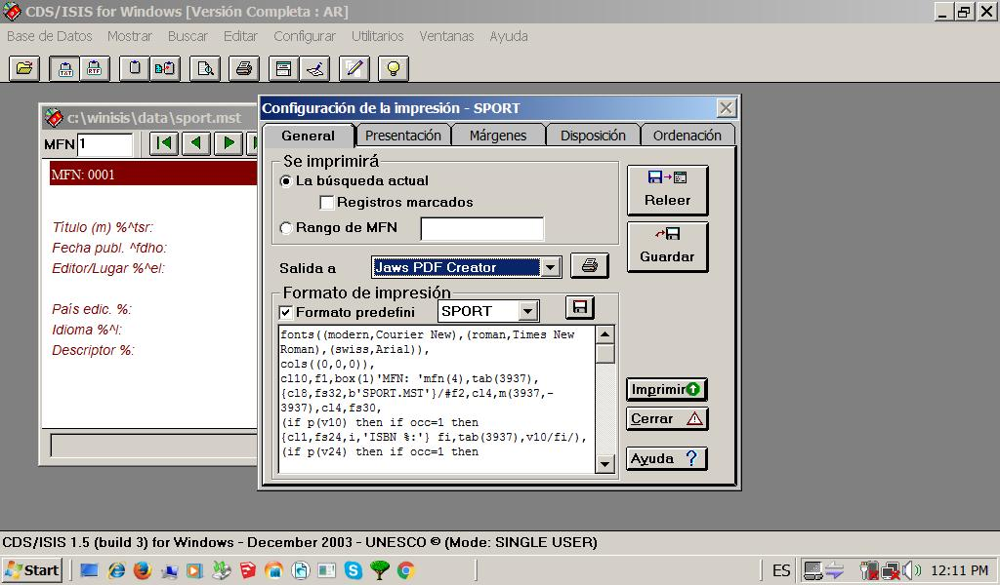
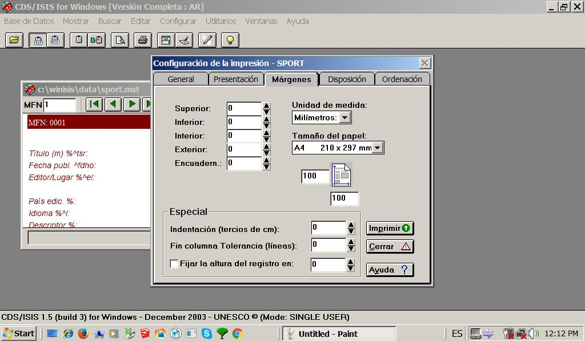
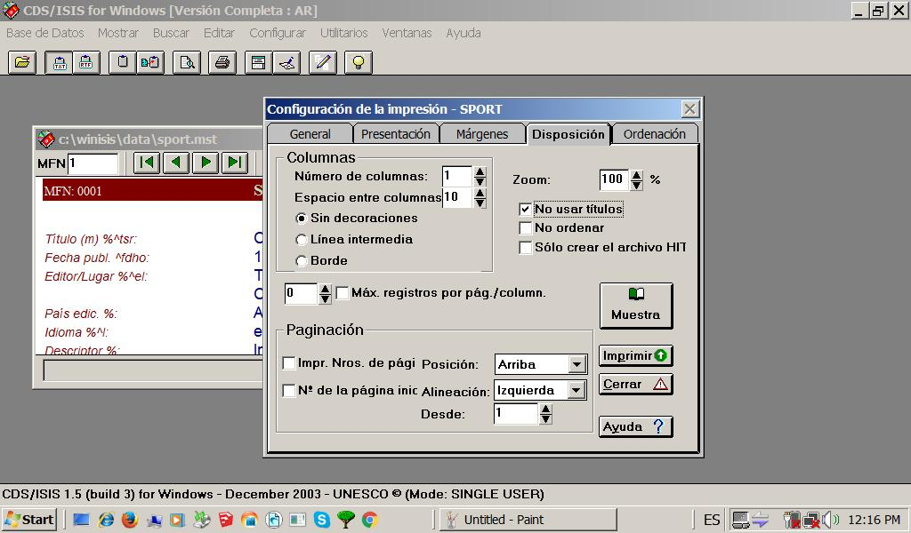

 

> *Advertencia: Este documento es para uso interno y refleja nuestros criterios operativos*

### Exportación (uso interno)
* Verifique la estabilidad de su sistema operativo, ej.: no posea virus informáticos
* Deshabilite compartir archivos y carpetas durante el proceso de exportación
* Si ya tiene instalada una impresora virtual PDF, siga con el siguiente paso. Si no tiene instalada una impresora virtual PDF, visite este [enlace](https://pdf.wondershare.com/top-pdf-software/free-pdf-printer.html) e instale alguna de las opciones ofrecidas de acuerdo a su sistema operativo.
* Ejecutar WinIsis
* Verifique el estado y estabilidad general de su base de datos. Valide y depure sus registros. Corrija cualquier carácter incompatible con su versión de WinIsis. Verifique los registros borrados
* Seleccione y cargue la base de datos que desea exportar. Compruebe la suma total de registros (en caso de que desee exportar toda su base de datos), o en su defecto, qué registros desea exportar
  

* (_Opcional_) Actualice el diccionario (`Base de Datos` > `Actualizar Diccionario`)
* Aparecerá el cuadro de diálogo `Mantenimiento del Archivo Invertido`. Elija alguna de las opciones suministradas: `Actualizar`, `Inversión total`, `Reiniciación del Archivo Invertido`, `Crear archivos de enlaces`, `Clasificar los archivos`, `Cargar el Archivo Invertido`. Luego, elija `Aceptar`
  

* Vaya a `Base de Datos` > `Imprimir`. Elija si desea imprimir `La búsqueda actual` o un `Rango de MFN`: ingrese aquí los números de registros que desea exportar; ej.: 1-999999. En `Salida a` elija la impresora virtual PDF apuntada párrafos arriba. En nuestro caso elegimos `Jaws PDF Creator`. Por último, en `Formato de impresión`, elija la opción `Formato predefinido`.
  

* Luego diríjase a la pestaña `Márgenes`: ingrese `0` (cero) en las opciones `Superior`, `Inferior`, `Interior` y `Exterior`. En `Tamaño del papel`: consigne `A4` o `Legal`.  Todas las opciones de la sección `Especial`, dejarlas en `0`. 
  

* Luego diríjase a la pestaña `Disposición`: en `Número de columnas` ingresar 1, en `Espacio entre columnas` ingresar `10`, luego elegir la opción `Sin decoraciones`, dejar `0` en `Máx. registros por pág./column.`; en la sección `Paginación` dejar las opciones predeterminadas, es decir: `Arriba`, `Izquierda`, `1`; en la sección `Zoom` ingresar `100` y apuntar afirmativamente en `No usar títulos`.
  

* Clic en `Imprimir`. Pedirá que le demos un nombre al archivo pdf que se generará. Clic en `Aceptar`.
* El archivo pdf generado puede ser editado en paquetes de ofimática tales como [LibreOffice](https://ask.libreoffice.org/es/question/57975/se-pueden-abrir-archivos-pdf-con-libreoffice/) y [Microsoft Word](https://support.office.com/es-es/article/editar-un-archivo-pdf-b2d1d729-6b79-499a-bcdb-233379c2f63a).
* Puede consultar estos enlaces sobre cómo buscar y reemplazar formatos de texto y formatos especiales (como formatos de carácter y párrafo), estilos y resaltado, y cambiarles el formato sin modificar el texto en Word [aquí](https://support.office.com/es-es/article/buscar-y-reemplazar-texto-c6728c16-469e-43cd-afe4-7708c6c779b7) (Windows), o [acá](https://support.office.com/es-es/article/buscar-y-reemplazar-texto-o-formato-en-word-para-mac-ac12f262-e3cd-439a-88a0-f5a59875dcea) (macOSX).

### Copyright ###

This work is licensed under a [Creative Commons Attribution-ShareAlike 2.0 Generic License](http://creativecommons.org/licenses/by-sa/2.0/).

### Legal ###

* All trademarks are the property of their respective owners.
