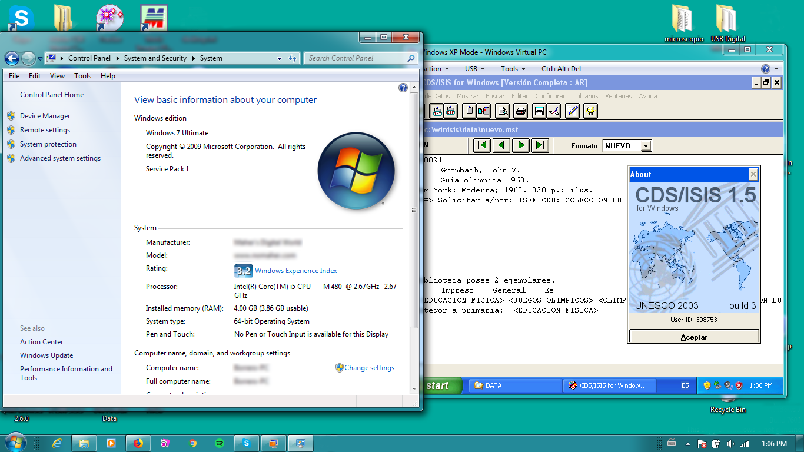
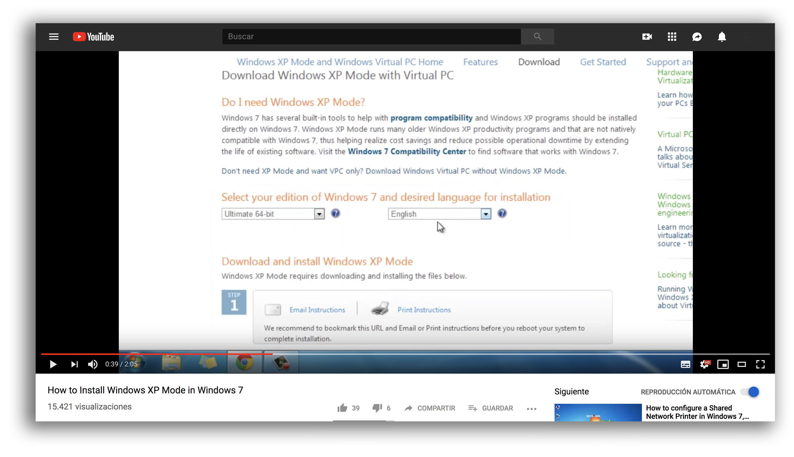
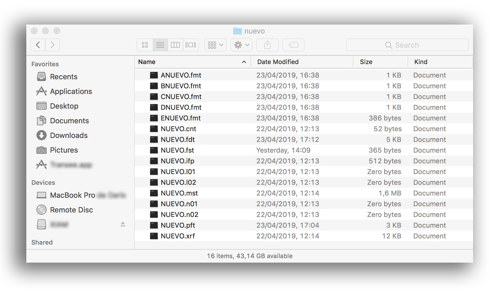

### Checklist 

* Verify if there is enough room to install WinIsis (< 10 MBs) and [Windows XP Mode](https://www.microsoft.com/en-us/download/details.aspx?id=8002) (almost 500 MBs)
  

> _WinIsis running inside a Windows XP Mode inside a session of Windows 7_

* Verify our [WinIsis compatibility test](https://bitbucket.org/imhicihu/winisis-migration/issues/1/software-winisis-compatibility-test)
* If your operating system is Windows Vista 64 bits, Windows 7 (32 & 64 bits), install [Windows XP Mode](https://www.microsoft.com/en-us/download/details.aspx?id=8002). How to install it can be found [here](https://www.youtube.com/watch?v=GssiPwiNAw4)

* Update your antivirus definition's to the latest version
* Check the health of your operating system: verify that you are out of malware & virus on your pc
* Minimum screen size: 800 x 600 pixels
* Install a fresh copy of WinsIsis
* Run it to verify everything is OK.
* copy from `c:\WinIsis\Data` those files that match the name of your database, ie.: `Nuevo`. So, choose those files that meet the criteria:
	- *.cnt
	- *.fdt
	- *.fst
	- *.ifp
	- *.l01
	- *.l02
	- *.mst
	- *.n01
	- *.n02
	- *.pft
	- *.xrf
	

* once copied, copy this files to your brand new WinIsis installation, pointed out and go for `c:\WinIsis\Data`. Paste those files inside here.
* Run your WinIsis. Choose your new database (ie. in our case: `Nuevo`). 
* Presto
